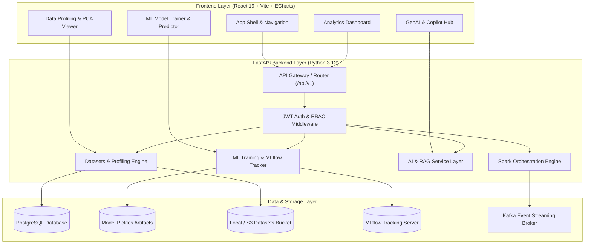

# System Architecture Diagram

Unified Enterprise AI Analytics Platform system architecture diagram and component interaction overview.

```mermaid
flowchart TB
    subgraph Clients["Frontend Layer (React 19 + Vite + ECharts)"]
        UI["App Shell & Navigation"]
        Dash["Analytics Dashboard"]
        ProfUI["Data Profiling & PCA Viewer"]
        MLUI["ML Model Trainer & Predictor"]
        AICopilot["GenAI & Copilot Hub"]
    end

    subgraph API["FastAPI Backend Layer (Python 3.12)"]
        Router["API Gateway / Router (/api/v1)"]
        Auth["JWT Auth & RBAC Middleware"]
        DatasetsSvc["Datasets & Profiling Engine"]
        MLService["ML Training & MLflow Tracker"]
        AIService["AI & RAG Service Layer"]
        SparkSvc["Spark Orchestration Engine"]
    end

    subgraph DataInfra["Data & Storage Layer"]
        DB[(PostgreSQL Database)]
        Models[(Model Pickles Artifacts)]
        Storage[(Local / S3 Datasets Bucket)]
        MLflow[(MLflow Tracking Server)]
        Kafka["Kafka Event Streaming Broker"]
    end

    UI --> Router
    Dash --> Router
    ProfUI --> DatasetsSvc
    MLUI --> MLService
    AICopilot --> AIService

    Router --> Auth
    Auth --> DatasetsSvc
    Auth --> MLService
    Auth --> AIService
    Auth --> SparkSvc

    DatasetsSvc --> DB
    DatasetsSvc --> Storage
    MLService --> MLflow
    MLService --> Models
    SparkSvc --> Kafka
```
