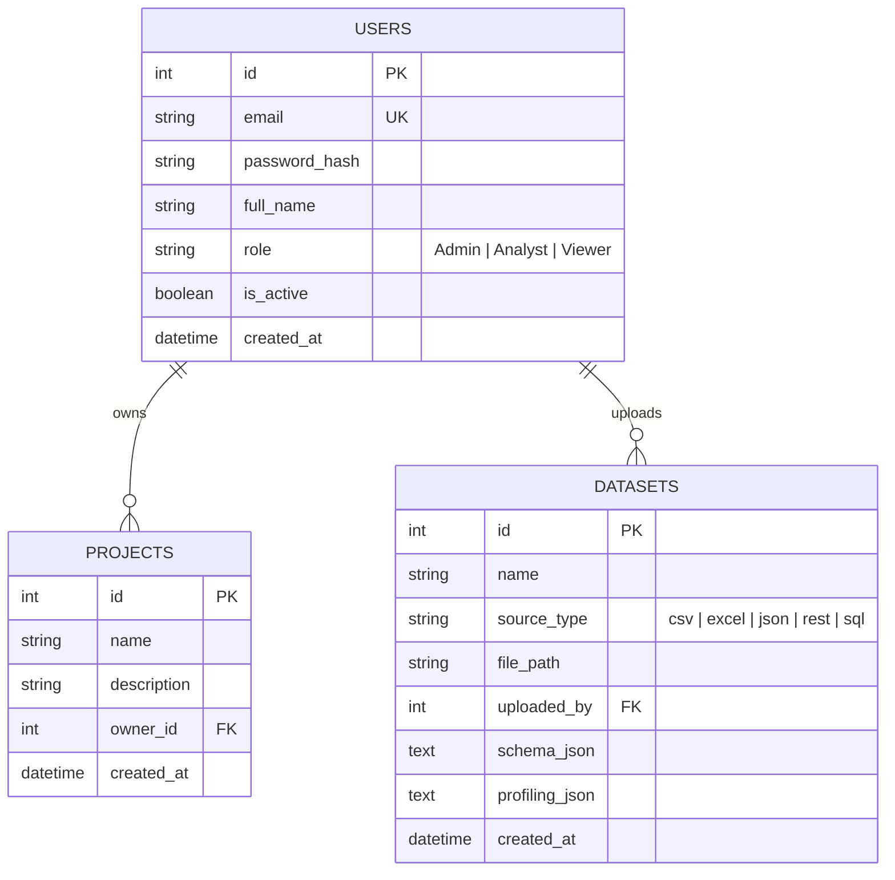

# Database Schema Diagram & ERD

Relational database schema structure for users, roles, projects, datasets, and model metadata.

```mermaid
erDiagram
    USERS {
        int id PK
        string email UK
        string password_hash
        string full_name
        string role "Admin | Analyst | Viewer"
        boolean is_active
        datetime created_at
    }

    PROJECTS {
        int id PK
        string name
        string description
        int owner_id FK
        datetime created_at
    }

    DATASETS {
        int id PK
        string name
        string source_type "csv | excel | json | rest | sql"
        string file_path
        int uploaded_by FK
        text schema_json
        text profiling_json
        datetime created_at
    }

    USERS ||--o{ PROJECTS : "owns"
    USERS ||--o{ DATASETS : "uploads"
```
